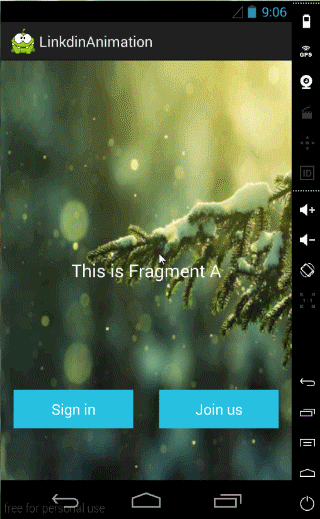
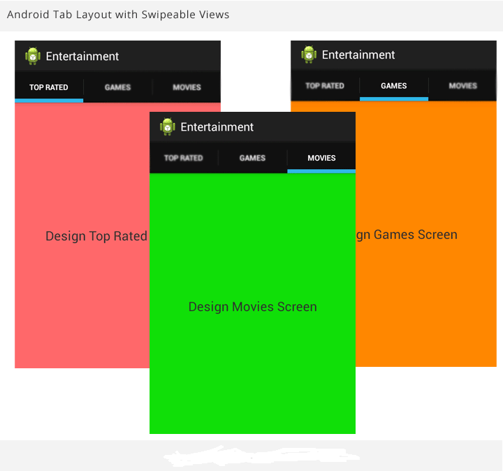

# BlueUI
BlueUi is aimed at creating an android liberary module which will enable faster and simpler UI developement . To add this module to youre android project either directly download this liberary or use ` git clone https://github.com/jemshid123/BlueUI.git `  command and then add the module as a dependency.
 
 <h2>View Pager with custom effects</h2>
 
 
This allows you to create a simple view pager with zoom out effect on swiping 

 
 
To create a viewpager add a viewpager widget to youre XML Layout file 

         <android.support.v4.view.ViewPager
        android:layout_width="match_parent"
        android:layout_height="100dp"
        android:id="@+id/vp">
        </android.support.v4.view.ViewPager>
        
 Then create a viewpager object
 
     //creating initial fragments to be viewed
    Fragment fragment[]=new Fragment[]{new f1(),new f2()};
    
     // creating slidefragmentviewpageradapter as viewpageradapter  
    slideFragmentViewPagerAdapter slide=new slideFragmentViewPagerAdapter(getSupportFragmentManager(),fragment);
    
    ViewPager viewPager=(ViewPager)findViewById(R.id.vp);
    viewPager.setAdapter(slide);
    
    //page transformer adds effects. in this case Zoom out effect
    viewPager.setPageTransformer(false,new zoomOutPageTransformer());
    
    
 you can also add new fragments to the view pager dynamically at runtime
 
     slide.addFragment(new f1());
     
  <h2>Swipe Tab Widget</h2>
  
 swipeTab widget allows easier creation of swipable tab views on android. its easy to use and give a high degree of flexibility to user 

  
  
  
  .To create a swipable tab layout add the swipeTab widget to XML layout  file.
  
    <com.face.www.blueui.widgets.swipeTab
        android:layout_width="match_parent"
        android:layout_height="match_parent"
        android:id="@+id/tabs"
        />
        
  .Then create a swipeTab object
     
     swipeTab  st=(swipeTab)findViewById(R.id.tabs);
     st.initialze(getSupportFragmentManager(),getSupportActionBar());
     
   Adding a  tab with title and fragment
   
        st.addTab("hi",new f1());
        
   Adding a tab with title, drawable and fragment object
   
        st.addTab("hello",android.R.drawable.ic_media_play,new f2());
        
   Using getTab() you can directly access a tab. this allows more flexibility
   
        ActionBar.Tab tab=st.getnewTab();
        tab.setText("hai");
        tab.setTabListener(new ActionBar.TabListener() {
            @Override
            public void onTabSelected(ActionBar.Tab tab, FragmentTransaction ft) {

            }

            @Override
            public void onTabUnselected(ActionBar.Tab tab, FragmentTransaction ft) {

            }

            @Override
            public void onTabReselected(ActionBar.Tab tab, FragmentTransaction ft) {

            }
        });
        
        //adding the tab and fragment object
        st.addTab(tab,new f1());

 
  
  
   
 
 
 

